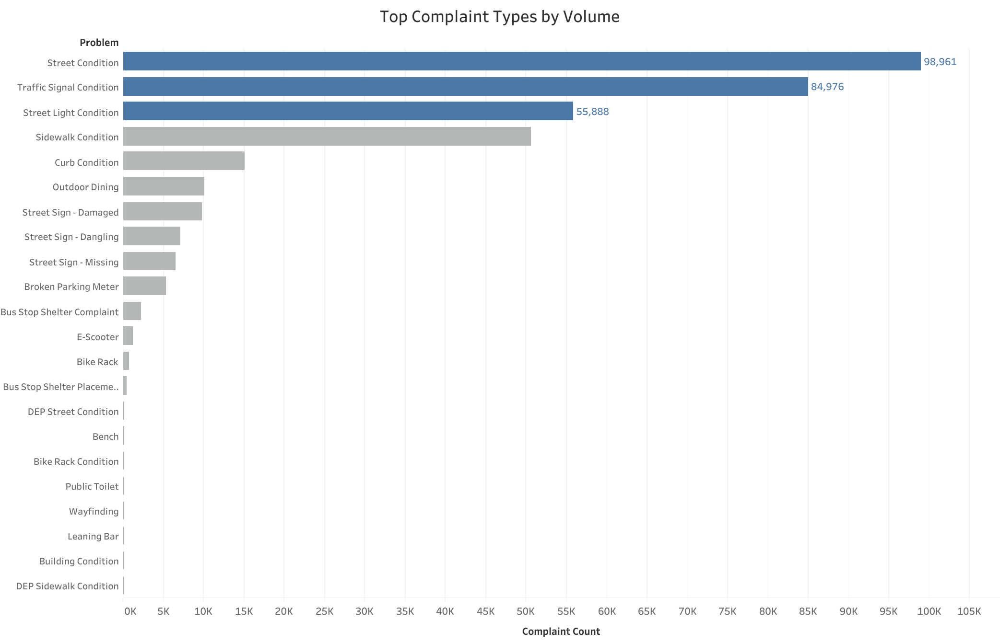
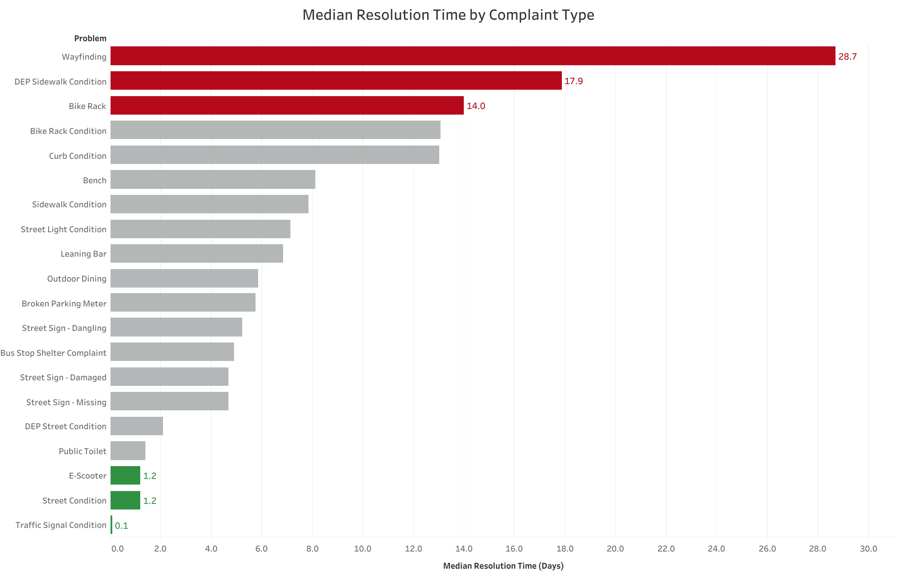
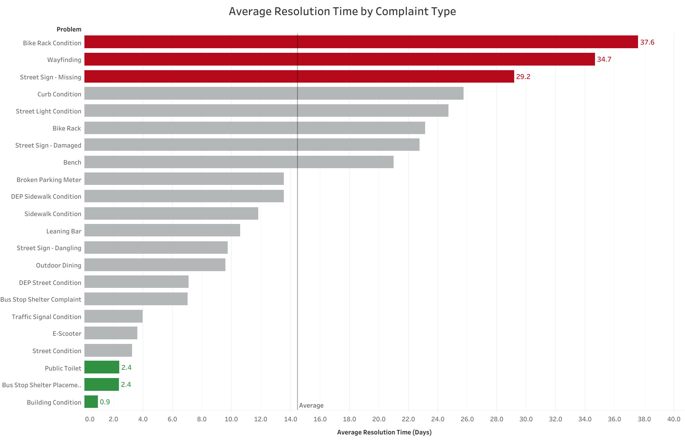
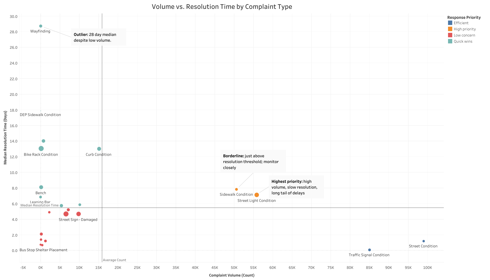

# NYC 311 DOT Complaint Analysis: Evaluating Response Efficiency Using Service Request Data

## Overview

This project analyzes New York City's 311 Service Request data to evaluate the operational efficiency of the Department of Transportation (DOT) in responding to resident-reported infrastructure issues.

Using complaint data from 2024-2025, the analysis examines complaint volume, resolution times, geographic distribution, and complaint categories to identify patterns in service performance and highlight opportunities for improvement.

The project was completed as part of a team-based data analytics capstone. Due to the size of the dataset, data cleaning responsibilities were divided among team members using Google Sheets before being consolidated and validated through Python. The final analysis and visualizations were created in Tableau.

---

## Business Problem

The NYC Department of Transportation receives thousands of service requests each year through the 311 system. These complaints range from street defects and traffic signal issues to roadway maintenance concerns.

Understanding how quickly complaints are resolved, where complaints occur most frequently, and which issue types require the longest response times can help city agencies allocate resources more effectively and improve service delivery.

This analysis seeks to answer:

- How efficiently does NYC DOT resolve 311 complaints?
- Which complaint types take the longest and shortest to resolve?
- Which boroughs generate the highest complaint volume?
- Are high-volume locations associated with slower response times?
- How do complaint patterns vary across geography and complaint type?

---

## Dataset

**Source:** NYC Open Data

**Dataset:** 311 Service Requests from 2020 to Present

### Analysis Scope

- Department of Transportation (DOT) complaints only
- Complaints from 2024–2025
- Closed requests with valid geographic and timestamp information

### Key Fields

| Field | Purpose |
|---------|---------|
| Unique Key | Complaint identifier |
| Created Date | Complaint submission timestamp |
| Closed Date | Complaint resolution timestamp |
| Complaint Type | Primary issue category |
| Descriptor | Detailed complaint description |
| Borough | Geographic analysis |
| Incident Zip | Localized analysis |
| Latitude / Longitude | Spatial validation |
| Status | Complaint closure status |

---

## Data Cleaning & Preparation

### Collaborative Data Cleaning

Due to the size of the dataset, data cleaning responsibilities were divided among five team members using Google Sheets.

Each team member was responsible for validating and standardizing a portion of the dataset, including:

- Date validation
- Missing value identification
- ZIP code verification
- Geographic coordinate validation
- Resolution time quality checks
- Data formatting and consistency checks

This collaborative approach allowed the team to efficiently review a large volume of records while maintaining consistent quality standards.

### Data Consolidation

After the initial cleaning process, the cleaned CSV files were consolidated into a single source-of-truth dataset using Python and pandas.

Duplicate complaints were removed using the `Unique Key` field to ensure each complaint was represented only once.

### Data Validation

Additional validation checks were performed to retain only records that met all quality requirements:

- Valid Created Date
- Valid Closed Date
- Valid ZIP Code
- Valid Geographic Coordinates
- Positive Resolution Time

Records failing any validation check were removed from the final analytical dataset.

### Feature Engineering

Additional analytical metrics were created to support performance analysis:

- Resolution Time (Days)
- Resolution Time (Hours)

Resolution time was calculated as the difference between complaint creation and closure timestamps.

### Data Preparation Workflow

```text
NYC 311 DOT Complaint Data
            ↓
Team-Based Cleaning in Google Sheets
            ↓
Validation & Standardization
            ↓
Export Cleaned CSV Segments
            ↓
Python Dataset Consolidation
            ↓
Duplicate Removal
            ↓
Resolution Time Calculation
            ↓
Final Analytical Dataset
            ↓
Tableau Visualizations
            ↓
Executive Summary & Recommendations
```

---

## Methodology

The analysis focused on four dimensions of service performance.

### Resolution Efficiency

Measured how quickly complaints were resolved using:

- Average Resolution Time
- Median Resolution Time

Both metrics were used because averages can be influenced by extreme cases, while medians provide a better representation of typical service performance.

### Complaint Demand

Measured workload through:

- Total Complaint Count
- Complaint Volume by Borough
- Complaint Volume by Complaint Type

### Geographic Distribution

Compared complaint activity across boroughs to identify potential differences in service demand and response performance.

### Complaint Type Analysis

Compared complaint categories to identify:

- Most common complaint types
- Longest average resolution times
- Shortest average resolution times

---

## Key Questions

### Operational Efficiency

- How efficient is DOT in resolving complaints across boroughs?
- What is the average resolution time by borough?
- What is the median resolution time by borough?
- How does resolution time vary across complaint types?

### Complaint Demand

- Which boroughs generate the highest complaint volume?
- Which complaint categories occur most frequently?

### Service Performance

- Which complaint types take the longest to resolve?
- Which complaint types are resolved most quickly?

### Geographic Equity

- Are some boroughs slower to receive service than others?
- Are high-volume areas associated with slower response times?

### Trends Over Time

- How do complaint volumes change over time?
- Are complaint trends increasing or decreasing?

---

## Visualization Highlights

### Volume of Complaints by Type



This visualization highlights the most common DOT-related complaint categories and helps identify areas generating the highest service demand.

---

### Resolution Time by Type (Median)



Median resolution times provide insight into the typical time required to resolve each complaint category while reducing the impact of extreme outliers.

---

### Resolution Time by Type (Average)



Average resolution times highlight complaint categories that may require additional resources or more complex resolution processes.

---

### Complaint Volume vs. Resolution Time



This scatter plot compares complaint volume against average resolution time to identify whether high-demand complaint categories are associated with slower response performance.

---

## Tools Used

### Data Cleaning & Processing

- Python
- pandas
- Google Sheets

### Data Analysis & Visualization

- Tableau

### Reporting

- Google Docs
- Google Slides

---

## Repository Structure

```text
nyc-311-dot-complaint-analysis/
│
├── README.md
│
├── data/
│   ├── raw/
│   └── cleaned/
│
├── scripts/
│   ├── merge.py
│   ├── filter_valid_rows.py
│   └── add_resolution_time.py
│
├── tableau/
│   ├── complaint_volume_type.png
│   ├── resolution_time_type_median.png
│   ├── resolution_time_type_average.png
│   ├── volume_resolution_time_comparison.png
│   └── Mid Cycle Visualization Project.twbx
│
├── reports/
│   ├── one_pager.pdf
│   └── presentation_deck.pdf
│
└──
```

---

## Results & Recommendations

The full findings, visualizations, and recommendations can be found in the Executive Summary and Presentation Deck included in this repository.

Key insights focus on complaint demand, response efficiency, geographic service patterns, and opportunities for improving NYC DOT operational performance.